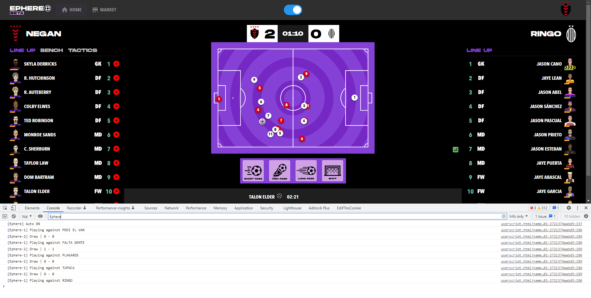

# ephere-auto-mode
Automatic play for Ephere game

# Installation
1. [Install Tampermonkey](https://tampermonkey.net/) (you can see how in [this official YouTube video](https://www.youtube.com/watch?v=8tyjJD65zws))
2. Copy the script's code.
3. Create a new script in Tampermonkey and paste the copied code.
4. Save the file.
5. Refresh Ephere's tab if you had it already opened.
6. After clicking Play in Ephere, you should see the toggle switch in the middle of the top bar.
7. Enjoy!

# Screenshot

